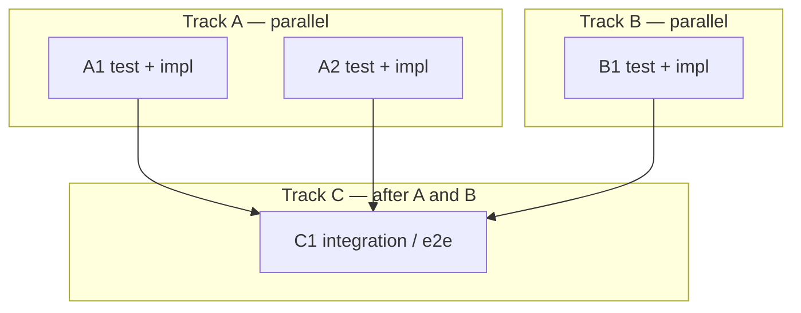

# /mvilla-plan

Turn a feature request (or GitHub issue) into a TDD-first implementation plan.
The plan is a document, not code — do not edit source files while planning.
Switch to Plan mode if available.

**Announce at start:** "I'm using the mvilla-plan skill to create the
implementation plan."

Builds on [`.cursor/skills/plan/SKILL.md`](../plan/SKILL.md). Follow that
skill's non-negotiable rules (no assumptions, TDD, AGENTS.md, parallelize,
required sections) plus the additions below.

## Input sources

Accept either:

1. **Freeform request** — same as `/plan`
2. **GitHub issue** — `/mvilla-plan <issue-link>` or an issue number/URL in the
   message

### GitHub issue intake

When an issue link/number is provided:

1. Fetch the issue (`gh issue view <n> --json …` or GitHub MCP `issue_read`)
2. Read title, body, labels, milestone, and comments
3. Treat the issue as the primary spec; restating the goal must name the
   issue (`#N` + title)
4. Record in the plan header:
   - **Issue:** `#N` — full URL
   - **Issue summary:** 1–2 sentences from the body
5. Ambiguities in the issue are clarifying questions (with recommended
   defaults) — never invent missing acceptance criteria

If the issue cannot be fetched, stop and ask for the text or access.

## Feature branch (always)

Every plan must state that **implementation runs only on a feature branch** —
never on `main`/`master`.

Include in the plan:

```markdown
## Execution branch

- **Branch:** `feat/<short-slug>` (or `fix/` / `chore/` as appropriate)
- **Base:** `main` (confirm if different)
- **Rule:** Create/check out the branch before any implementation commit.
  Do not commit to `main`/`master`.
```

If a linked issue exists, prefer `feat/<n>-<short-slug>` so the branch maps to
the ticket.

## Workflow

```
- [ ] 1. Resolve input (freeform vs GitHub issue); fetch issue if linked
- [ ] 2. Restate the goal in one sentence; confirm with the user
- [ ] 3. Read root AGENTS.md + scoped AGENTS.md for affected areas
- [ ] 4. Explore the codebase to ground the design in existing patterns
- [ ] 5. List ALL open questions; ask the user (with recommendations)
- [ ] 6. Wait for answers — do not proceed past unresolved blockers
- [ ] 7. Write the plan using the template (incl. mermaid parallelism map + branch)
- [ ] 8. Run code-architect + frontend-design audits; fold findings in
- [ ] 9. Verify against the checklist; present the plan
```

Steps 2–6 match `/plan`. Step 7 adds the mermaid map and branch section.
Step 8 is required before presenting.

## Parallelism mermaid map (required)

After the TDD tracks section, include a **Parallelism map** that shows which
tracks/tasks can run concurrently vs must wait.

Use a mermaid flowchart (or graph). Example shape:



Rules:

- Nodes = tasks (same IDs as in the track lists)
- Edges = real dependencies only
- Independent tracks must be visually parallel (sibling subgraphs or no edge
  between them)
- Call out in one sentence under the diagram: what can run in parallel agents
  vs what must stay sequential

## Post-draft audits (required)

After the first complete draft, run both audits **before** presenting the plan
as final. Prefer dispatching them in parallel (Task tool / subagents).

### 1. `/code-architect` audit

Launch a `code-architect` subagent (or equivalent) with:

- The draft plan
- Relevant paths / AGENTS.md architecture boundaries
- Ask for: component boundaries, data flow, file placement, dependency
  direction, risks of coupling, and concrete plan edits

Fold accepted findings into the Design summary, file map, and tasks.

### 2. `/frontend-design` audit

When the work touches UI (components, editor chrome, layout, motion, theme):

- Load the `frontend-design` skill **and** the repo design guidelines in
  `AGENTS.md`
- Audit the plan for: composition, typography roles, token usage (no raw
  colors), restraint vs clutter, light/dark, a11y, motion gated by
  `prefers-reduced-motion`
- For Scribe, **AGENTS.md wins** over generic “bold/maximalist” defaults —
  the audit raises quality within the app’s calm, content-first language

If the change is non-UI (pure data/Rust/infra), note “frontend-design audit:
skipped (no UI surface)” and still run code-architect.

### Audit record

Add to the plan:

```markdown
## Design audits

- **code-architect:** <summary of findings → changes made to plan>
- **frontend-design:** <summary / skipped>
```

## Output template

````markdown
# Plan: <feature name>

**Issue:** #<n> — <url> <!-- omit if no issue -->

## Design summary

<2–5 sentences: what we're building, approach, why. Name key components/files
and how they fit the architecture.>

**AGENTS.md constraints honored**

- <…>

**Decisions confirmed with user**

- <question> → <resolved answer> (recommended: <default>)

## Execution branch

- **Branch:** `feat/<n>-<short-slug>`
- **Base:** `main`
- **Rule:** All implementation commits land on this branch only — never on
  `main`/`master`.

## Acceptance criteria → tests

| #   | Acceptance criterion (observable behavior) | Test(s)       | Type                   | File             |
| --- | ------------------------------------------ | ------------- | ---------------------- | ---------------- |
| AC1 | <user-visible behavior>                    | `<test name>` | unit / component / e2e | `<path>.test.ts` |

## TDD implementation strategy

Each task: failing test(s) first, then minimal code, then refactor. Tasks in
the same track are parallelizable; tracks ordered by dependency.

**Track A (parallel) — <area>**

- [ ] A1. Test `<name>` (AC1) → implement <thing>
- [ ] A2. Test `<name>` (AC2) → implement <thing>

**Track B (parallel) — <area>**

- [ ] B1. Test `<name>` (AC3) → implement <thing>

**Track C (depends on A, B) — integration**

- [ ] C1. e2e test `<name>` (AC4) → wire together

## Parallelism map


<One sentence: what runs in parallel vs what is gated.>

## Design audits

- **code-architect:** <…>
- **frontend-design:** <…>

## Risks & non-goals

- **Risk:** <risk> → <mitigation>
- **Out of scope:** <explicit non-goal>

## Verification

- [ ] `npm run verify` passes
- [ ] All acceptance criteria have passing tests
````

## Final checklist

Before presenting:

- [ ] Issue fetched and cited (if an issue was provided)
- [ ] No unresolved assumptions — ambiguities asked with recommendations
- [ ] Relevant AGENTS.md read; constraints listed
- [ ] Design summary present and concrete
- [ ] Every acceptance criterion maps to at least one named test
- [ ] Tests precede implementation in every task (TDD)
- [ ] Parallelism mermaid map present and matches track IDs
- [ ] Execution branch section present (feature branch only)
- [ ] code-architect audit run; findings folded in
- [ ] frontend-design audit run or explicitly skipped with reason

## Execution handoff

After presenting the plan, offer:

**"Plan ready. Run `/mvilla-execute` with this plan (and the issue link if any)
to implement on a feature branch, mark the ticket in progress, and open a PR."**
