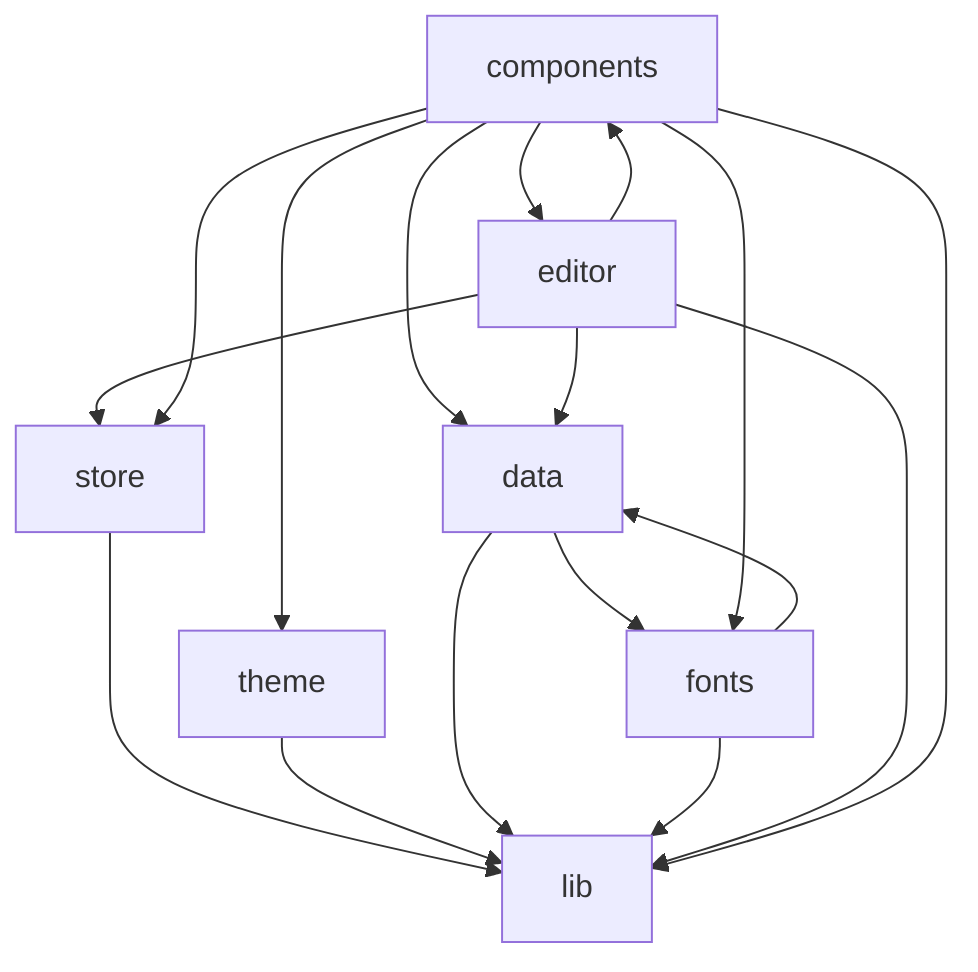

# AGENTS.md

Scribe is a minimalist desktop writing app: Tauri 2 (Rust) shell + React 19 + TypeScript + Vite, with a Supabase backend (Postgres + Google OAuth).

This file applies to the whole repo. Scoped `AGENTS.md` files add area-specific rules:

- [`src/components/ui/AGENTS.md`](src/components/ui/AGENTS.md) — design-system primitives
- [`src/editor/AGENTS.md`](src/editor/AGENTS.md) — TipTap/ProseMirror editor
- [`src/data/AGENTS.md`](src/data/AGENTS.md) — React Query data layer
- [`src/store/AGENTS.md`](src/store/AGENTS.md) — Zustand UI state
- [`e2e/AGENTS.md`](e2e/AGENTS.md) — Playwright end-to-end specs
- [`src-tauri/AGENTS.md`](src-tauri/AGENTS.md) — Rust/Tauri shell

## Setup

- Use **npm** (this repo pins it). Node `>=22 <23`, npm `>=10 <11`; the version is in `.nvmrc`.
- Install with `npm install`.
- App config lives in `.env.local` at the project root: `VITE_SUPABASE_URL` and `VITE_SUPABASE_ANON_KEY`.
- **Git worktrees:** `.env.local` is gitignored, so linked worktrees do not
  inherit it. Create worktrees with `./scripts/git-worktree-add.sh` (same args
  as `git worktree add`) so `.env.local` is copied from the primary checkout.
  If you already used plain `git worktree add`, run
  `./scripts/sync-worktree-env.sh` from the new worktree (or pass its path from
  the primary checkout), then `npm install`. A Husky `post-checkout` hook is
  best-effort only after husky is installed in that worktree — it does **not**
  run on a fresh `git worktree add`.

## Commands

- `npm run tauri dev` — run the desktop app (Vite + Tauri shell, HMR)
- `npm run dev` — run the Vite frontend only in a browser
- `npm run typecheck` — `tsc -b`
- `npm run lint` — ESLint (`--max-warnings 0`; warnings fail)
- `npm run test` / `npm run test:watch` — Vitest
- `npm run e2e` — Playwright end-to-end tests
- `npm run format` — Prettier write

**Before declaring any task done, run `npm run verify`.** It is the full gate:
typecheck + lint + circular-dependency check (madge) + dead-code/unused-deps
(knip) + format check + tests + build. CI runs the same checks, so a passing
`verify` is what keeps the build green.

## Conventions

All of these are enforced by ESLint/Prettier — follow them so `verify` stays green.

- **File & folder names**: kebab-case everywhere under `src/`, regardless of what the module exports (a `BookView` component lives in `book-view.tsx`).
- **Imports**: use the `@/` alias for non-sibling imports; parent-relative `../` imports are banned. Only same-directory `./` paths stay relative.
- **Naming**: PascalCase for types, camelCase for values, UPPER_CASE for module-level constants. Prefix intentionally-unused/discarded identifiers with `_`.
- **Type assertions**: no `as unknown` double-casts and no object-literal casts (`{ ... } as T`). Use a typed variable or `satisfies` instead. `x as T` is allowed where unavoidable.
- **Suppressions**: every `eslint-disable` needs an inline `-- reason`. Unused disable directives are an error.
- **JSDoc**: the exported API of the `data/`, `lib/`, `fonts/`, `store/`, and `editor/` layers requires a description block (no `{type}` tags — TypeScript carries the types).
- **Logging**: `console` is limited to `warn` and `error`.
- **No native dialogs**: `window.alert`/`confirm`/`prompt` are banned (`no-alert`); use an in-app dialog or popover (e.g. the `LinkPopover`/`PagePicker`).
- **No native `title` tooltips**: the `title` attribute on host elements is banned (lint); use the `<Tooltip>` component for hover hints, and `aria-label` for an icon-only control's accessible name. (A component prop named `title`, e.g. `<ConfirmDialog title=…>`, is fine.)
- **No raw text `<input>`**: banned by lint except `file` / `checkbox` / `radio` / `hidden` and the `<Input>` primitive itself. Use `<Input>` or `<SearchField>` from `components/ui`.
- **Formatting**: Prettier — 2-space indent, double quotes, semicolons, trailing commas, 80-col width. Don't hand-format; run `npm run format`.

## Design guidelines

Scribe is a minimalist, pristine, elegant writing app. The experience should feel
calm, book-like, and content-first — chrome recedes, the writing leads. When
adding or changing UI, hold to the direction inferred from the existing styles
(`src/index.css` for tokens, `src/editor/editor.css` for the reading surface).

- **Restraint first**: prefer removing over adding. No decorative gradients,
  heavy borders, drop shadows for their own sake, or loud color. If an element
  doesn't earn its place, leave it out. Whitespace is a feature.
- **Tokens, never raw values**: style through the theme tokens (CSS variables /
  Tailwind theme colors like `bg-surface`, `text-muted`, `border-border`,
  `text-danger`, `bg-success`), never hardcoded hex or ad-hoc `rgba()` in
  components. Every color must have a light/dark pair — both themes are
  first-class, so verify both. Lint blocks raw Tailwind palette colors
  (`text-red-600`, `bg-emerald-500`) in `className` string literals.
- **Color**: warm and quiet, not stark. The page is warm paper (`--bg`), not pure
  white; ink is a warm near-black (`--text`); secondary text is a muted stone
  gray (`--muted`). There is a single restrained blue `--accent` — use it
  sparingly for selection/focus/links, not as fill. Surfaces stack subtly:
  `bg` < `surface` < `elevated`.
- **Typography**: the app chrome (sidebar, menus, dialogs) always stays on the
  stable system sans (`--font-sans`) — never serif or mono. The reading surface
  uses the editorial roles `--font-display` (titles/headings), `--font-text`
  (body), and `--font-code`, which are repointed at runtime to the user's chosen
  catalog fonts. Body/title/code sizes are metric-driven baselines (px via
  `--font-*-size`); derived type uses em/rem. Keep generous line-height and
  paragraph rhythm.
- **Shape & spacing**: use the radius scale (`--radius-sm` 6 / `--radius-md` 8 /
  `--radius-lg` 12). Favor soft, rounded, framed surfaces (cards, popovers) over
  hard rules. Space the reading surface in `em` units so rhythm scales with type.
- **Elevation**: depth comes from the subtle layered `--shadow-popover`, not
  borders. Popovers/dialogs/toasts share one elegant card language (rounded,
  soft shadow, hairline `--border`).
- **Motion**: fast, subtle, no bounce. Transitions are ~140–160ms `ease-out`;
  reach for the existing `scribe-*` keyframes (pop-in, fade-in, dialog-in,
  surface-in) rather than inventing new ones. Animation is a gentle accent, never
  attention-grabbing. **Always** gate motion behind
  `@media (prefers-reduced-motion: reduce)`.
- **Feedback**: keep it calm. Toasts tint the whole surface in a muted
  success-emerald / error-terracotta so status reads at a glance without
  shouting; match that quiet tone for any new feedback.
- **Accessibility**: `jsx-a11y` runs in strict mode — keep semantic markup,
  labels, and visible focus rings (`--ring`). Maintain contrast in both themes.
- **Design system first**: repeated chrome lives in [`src/components/ui/`](src/components/ui/).
  Prefer existing primitives (`Button`, `IconButton`, `Input` / `SearchField`,
  `Chip` / `StaticChip` / `RemovableChip`, `EmptyState`, `DashedAddTile`,
  `Popover`, `SegmentedControl`, `Breadcrumb*`, `Masthead`, `EditableText`,
  `InlineRename`, `CoverCard`) over copying their Tailwind stacks. See
  [`src/components/ui/AGENTS.md`](src/components/ui/AGENTS.md).
- **No raw text `<input>`**: use `<Input>` (or `<SearchField>`). Lint bans raw
  `<input>` except `file` / `checkbox` / `radio` / `hidden` and the `Input`
  primitive itself. Do not hand-roll bordered field chrome.
- **No hand-rolled chips / empties / icon buttons**: swatch pills use `Chip` /
  `StaticChip` / `RemovableChip`; dashed empty panels use `EmptyState`; icon
  chrome uses `IconButton`. Relation navigate chips stay feature-local (not
  `RemovableChip`).

## Performance

Keep interaction hot paths cheap and renders contained. These are conventions,
not lint-enforced — hold to them so typing, dragging, and navigation stay smooth.
See the scoped [`src/editor`](src/editor/AGENTS.md) and [`src/data`](src/data/AGENTS.md)
files for area-specific rules.

- **Stable props for lists**: give long lists (sidebar tree, page outline)
  memoized rows (`React.memo`) and referentially-stable handler props, so a drag
  or hover doesn't re-render every visible row.
- **Refs for latest callbacks**: when a value is only read inside an effect or a
  captured-once handler, hold it in a ref instead of widening a `useMemo`/effect
  dependency array — a new callback identity each render shouldn't bust a memo.
- **Drag interactions**: drive continuous gestures (sidebar resize, reorder)
  through a ref + `requestAnimationFrame` and commit the result once on
  `mouseup`; never write to a store or `localStorage` on every `mousemove`.
- **Defer expensive work**: debounce per-keystroke recomputes and gate heavy
  mounts (e.g. the editor) on the data they need rather than rendering then
  patching.

## Architecture boundaries

`eslint-plugin-boundaries` enforces a one-directional dependency graph between the
`src/` layers. Do not introduce imports that violate it.



- `lib` is the shared leaf layer — it imports nothing else in `src/`.
- `store` and `theme` may import from `lib` only.
- `data` may import from `fonts` and `lib`; `fonts` may import from `data` and `lib`.
- `editor` may import from `components`, `data`, `store`, and `lib`.
- `components` may import from `editor`, `data`, `fonts`, `store`, `theme`, and `lib`.
- App entrypoints (`src/*.tsx`, e.g. `app.tsx`, `main.tsx`) may wire anything together.

## Project structure

```
src/
  components/   App shell + UI primitives
    ui/         Design-system primitives                    -> src/components/ui/AGENTS.md
  editor/       TipTap/ProseMirror editor and extensions  -> src/editor/AGENTS.md
  data/         React Query hooks for books/folders/docs    -> src/data/AGENTS.md
  store/        Zustand UI state (persisted to localStorage)
  theme/        ThemeProvider (light/dark/system)
  fonts/        Font catalog + on-demand loading
  lib/          Supabase client, auth, generated DB types, utils
  test/         Vitest setup, MSW handlers, render helpers
src-tauri/      Tauri (Rust) shell, config, capabilities    -> src-tauri/AGENTS.md
e2e/            Playwright end-to-end specs                  -> e2e/AGENTS.md
```

## Test-driven development

Build features and fix bugs **test-first**. This is the default workflow for any
behavior change, not an optional extra.

- **Red → green → refactor**: write one failing test, make it pass with the
  minimal change, then clean up while staying green.
- **Watch it fail first**: run the new test and confirm it fails _for the right
  reason_ (the behavior is missing — not a typo or bad import) before writing the
  implementation. A test that passes the moment you write it proves nothing.
- **Minimal implementation**: write just enough to pass the current test; don't
  add unrequested options or abstraction ("YAGNI").
- **Good tests**: one behavior per test, a name that states that behavior, and
  assertions against real behavior — prefer real code, the real store, and the
  real query cache over mocks.
- **How to test here**:
  - Co-locate `*.test.ts(x)` next to the code under test.
  - Render components with `renderWithProviders` (`src/test/render-with-query.tsx`)
    and build entities with the factories in `src/test/fixtures.ts`.
  - Seed React Query with `client.setQueryData(<key>, …)` using the keys in
    `src/data/query-keys.ts`; reset Zustand stores in a `beforeEach`.
  - Data-layer tests intercept HTTP with **MSW** (see [`src/data/AGENTS.md`](src/data/AGENTS.md)),
    not by mocking the Supabase client.
- **Iterate on one file** (`npx vitest run <path>`) through the red/green cycle,
  then run `npm run verify` before declaring the task done.
- **Narrow exceptions** (use judgement, and call them out): throwaway spikes,
  generated code, and purely presentational/config tweaks (e.g. a tooltip side
  or a CSS-only change) where a test would assert nothing meaningful.

## Testing baseline

- **Unit/component**: Vitest in a jsdom environment, with co-located `*.test.ts(x)` files next to the code they cover. Testing Library + jest-dom are available.
- **End-to-end**: Playwright (`npm run e2e`); specs live in `e2e/`.
- **Never hand-edit** `src/lib/database.types.ts` — it is generated by the
  Supabase CLI. Any schema change is a two-step flow: (1) add a migration under
  `supabase/migrations/`, then (2) apply it and **regenerate** the types from the
  live schema — never author the type by hand:

  ```bash
  supabase db push                                   # apply the migration
  supabase gen types typescript --linked \
    > src/lib/database.types.ts                      # regenerate from the DB
  ```

  Commit the migration and the regenerated types together. If the CLI isn't
  available, mirroring the column by hand is a last resort that must be flagged
  and replaced with a real regeneration before merge.
